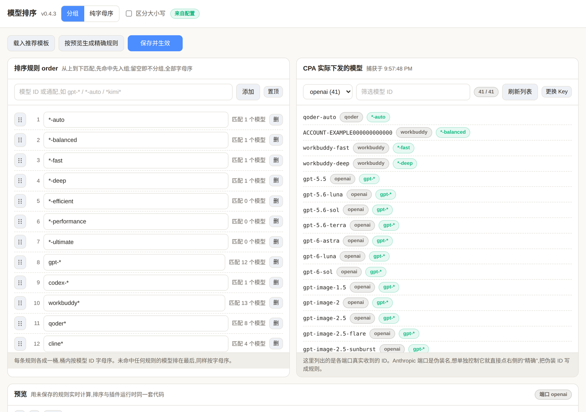

# model-registry

A [CLIProxyAPI](https://github.com/router-for-me/CLIProxyAPI) (CPA) plugin that decides what a
model listing endpoint serves: which entries a given API key may see, in what order, and
which of them are still leaking under a bare name.



## Why this exists

Three questions come up whenever several provider plugins share one CPA, and all three are
answered by the same thing: the final, cross provider, aliased model list.

**Ordering.** CPA builds `/v1/models` by ranging over a map keyed by model ID and never
sorts the result, so the served order is Go's randomised map order. It is frozen into the
registry cache and then reshuffled whenever that cache is invalidated, which model level
cooldowns do routinely. There is no native sort knob, and no field anywhere in CPA that
stores an order.

**Visibility.** CPA's `api-keys` is a bare string array, and nothing in the request path
narrows the list a key can see. A key restricted to one provider still receives the full
catalogue: `key-provider-access` enforces the restriction at call time and returns `403`,
but the listing was never filtered. Every key therefore learns what every other key can
reach.

**Aliases.** `oauth-model-alias` matches exactly and has no wildcard syntax, so a new
upstream model reaches clients under its bare name until someone adds a row for it. In
this deployment that surfaced as `space-bunny` sitting next to `workbuddy-space-bunny`.

This plugin takes the one seam CPA does provide: the response interceptor, which runs on
model list bodies **after** `oauth-model-alias` substitution. That makes it the single
place where the list can be filtered and ordered once, instead of every provider plugin
deciding something about its own slice of it.

## What this plugin does not do

It does not write CPA configuration. The host exposes no RPC for writing arbitrary
configuration, and a plugin holding the management key to do it would be a far larger
thing than one that reports a gap. The alias section of the panel therefore computes the
difference and then lets the **browser** call `/v0/management/oauth-model-alias`, where
the operator's management key already lives. The aliases stay CPA's; the plugin drives the
edit.

## Install

Build the plugin on the CPA host (it is `-buildmode=c-shared`, so build it where it
runs):

```bash
CGO_ENABLED=1 go build -trimpath -buildmode=c-shared -ldflags "-s -w" -o model-registry.so .
install -m 755 model-registry.so /opt/cpa/plugins/model-registry.so
```

Then register it and, importantly, give it the **lowest** priority so it runs last in
the interceptor chain. CPA orders interceptors by `priority` descending and then by
plugin ID ascending, and the last plugin to return a body decides the order:

```yaml
plugins:
  enabled: true
  dir: "plugins"
  configs:
    model-registry:
      enabled: true
      priority: -100
```

Restart CPA afterwards.

`order` is the only source of truth. There is no built-in rule: leave `order` out and
the plugin imposes no grouping, so the listing is simply alphabetical by model ID.

## Configuration

### Through the panel (recommended)

The plugin ships its own configuration page, registered as a CPA management
resource, so it appears in CPA's control panel menu as **Model Registry**. Open:

```text
http://<cpa-host>:<port>/v0/resource/plugins/model-registry/panel
```

It is a single page with three panes:

* **Rules** — the `order` list, editable in place: add, edit, delete, move up and
  down. Each rule shows how many of the currently served models it actually hits,
  so a typo that matches nothing is obvious.
* **Models CPA actually served** — the real IDs, per port, captured from the
  listings CPA returned. Pick one and press `exact` to pin it or `prefix` to
  group a provider family, without writing any glob syntax.
* **Preview** — the resulting order, computed by the plugin's own comparator so it
  cannot drift from runtime behaviour. Rows can be moved up and down by hand, then
  turned into an exact rule list with one click.

Saving writes `strategy`, `order` and `case_sensitive` through CPA's own
`PATCH /v0/management/plugins/model-registry/config`, which persists them into
`config.yaml` and hot reloads the plugin. No restart, no hand editing.

The page needs the CPA management key. It picks it up automatically when opened
from inside the CPA panel, accepts `?key=`, and otherwise asks for it. The panel
HTML itself is served unauthenticated and carries no secrets; every read and write
it performs goes through CPA's authenticated management API.

To check the page actually runs rather than just serving bytes:

```bash
./scripts/panel-smoke.sh [panel-url]
```

It loads the panel in a headless browser and asserts the script executed. Go tests
render the HTML but never run it, which is how a double quoted `MANAGEMENT_BASE_PATH`
once shipped as a syntax error and left the panel blank.

### Hand writing the YAML

The panel edits the same keys documented here, so either route works.

```yaml
model-registry:
  enabled: true
  priority: -100
  strategy: grouped        # grouped (default) | name
  case_sensitive: false
  order:                   # first match wins, one bucket per pattern
    - "auto"
    - "*-auto"
    - "gpt-*"
    - "codex-*"
  access:                  # per API key visibility, optional
    - caller_scope: "d66e70bffd410d852091e8987d47db72dadb15bd5ff3adf79be21afcd18228b2"
      label: workbuddy key
      allow_models: ["workbuddy-*"]
    - caller_scope: "3178c207645132badb56e19dda732b05a1a6358421ffddc24725f54034f4a51b"
      label: qoder key
      deny_models: ["*-preview"]
```

| Key | Default | Meaning |
|---|---|---|
| `strategy` | `grouped` | `grouped` puts configured buckets first; `name` sorts the whole list by model ID. |
| `order` | none | Ordered glob patterns matched against the model ID. Unset means no grouping. Models matching nothing tail the list alphabetically. |
| `case_sensitive` | `false` | Match and compare model IDs case sensitively. |
| `access` | none | Per caller visibility rules. Unset means every key sees the full list. |

Within one bucket, and in the unmatched tail, entries sort alphabetically by model ID.

## Per key visibility

### caller_scope

Policies are keyed by `caller_scope`, never by the API key itself, so this file never
holds a credential. The scope is the same digest CPA uses internally:

```bash
printf 'cli-proxy-api:caller-scope:v1\0%s' 'wba-...' | sha256sum
```

The plugin computes it from the request `Authorization` header (or `x-api-key`, which is
what an Anthropic shaped client sends) and compares digests, so a key never appears in
config in any form.

### A key with no policy is unrestricted

This is the property that makes the feature safe to deploy. A scope absent from the table
resolves to no policy, and no policy means the plugin does not touch the listing at all:
CPA's own bytes are served. An unrestricted key therefore needs no configuration, cannot be
constrained by accident, and cannot be broken by a typo in someone else's policy.

A policy whose `caller_scope` is empty is **dropped** rather than applied to everyone. An
unscoped rule is far more likely to be a half written entry than a deliberate "constrain
all keys", and reading it the other way would restrict keys the operator never meant to
touch.

### allow and deny

`allow_models` is an allowlist: when non-empty, nothing outside it is visible. `deny_models`
is subtracted afterwards. An **empty allow list means "no allowlist", not "nothing
visible"**, so a deny-only policy carves entries out of the full list rather than blanking
it. Both use the same pattern syntax as `order`.

Filtering runs **before** ordering. That ordering is deliberate: the sort exists to make
every captured model reachable, so running it first would let a hidden model reappear
through the alphabetical tail. A filter that removes an entry counts as a change even when
the survivors are already in the configured order, because otherwise the response would
fall through to CPA's original bytes and the hidden models would come straight back.

### Which ports are filtered

The OpenAI port and the Codex client catalog (`/v1/models?client_version=…`) are filtered;
the Claude and Gemini ports are not. Those two cloak or prefix their IDs in CPA core before
the body reaches any plugin, so a rule written against a real model name would silently
match nothing. Filtering the Codex catalog matters specifically: a model hidden from a key
must not reappear merely because the client asked with `?client_version=`.

## Model aliases

The panel's alias section is an editor for CPA's `oauth-model-alias`, not just a report. It
reads the whole table, lets you add, edit and delete any row, create channels, and write
the result back. CPA's table is the only source of truth; the plugin keeps no copy and
holds no key.

```
channel      name                alias
workbuddy    space-bunny          workbuddy-space-bunny
workbuddy    hy4-preview-dev      workbuddy-hy4-preview-dev
qoder        auto                 qoder-auto
```

Reading and writing go to CPA itself:

```
GET    /v0/management/oauth-model-alias
PATCH  /v0/management/oauth-model-alias   {"channel": "<provider>", "aliases": [ ... ]}
```

Three properties of that endpoint shape the editor:

- **`PATCH` replaces the whole channel**, it does not merge. The panel therefore keeps the
  loaded table as a read-only baseline and a separate draft, and writes the draft's full
  channel list.
- **`PUT` replaces the entire table** across every channel. The panel never issues it.
- **Only channels that were actually changed are written.** Since a `PATCH` overwrites the
  channel, a needless write could clobber rows someone added in the meantime, so an
  untouched channel is never sent. Edited and newly added rows are highlighted, so what a
  save will do is visible before it does it.

After a save the panel re-reads the table rather than assuming the write landed, so what
you see is always what CPA actually stores. CPA applies a change on its own schedule; the
observed hot apply is about twelve seconds, with no restart.

### Suggesting the missing ones

`oauth-model-alias` matches exactly, so an upstream model added after the last edit reaches
clients under its bare name. **补齐建议** scans the listing this plugin captured from real
traffic and offers the gaps for the current channel. Each one is *filled into the editor*
rather than written, so the normal save and its confirmation still apply.

Which providers are considered is decided by the channels that exist in CPA's own alias
table, not by how the model names look. That distinction matters: CPA's built-in `openai`
provider serves `gpt-5.5` and `gpt-6.1-sol` under exactly those names and has no alias
channel at all, so proposing `openai-gpt-6.1-sol` would invent an alias nobody asked for.
On a real 45 model listing, guessing from the names produced seventeen rows of which three
were real.

`provider/model` names such as cline's `anthropic/claude-opus-5.5` are skipped for a
separate reason: the provider already names them, and prefixing would propose
`cline-anthropic/claude-opus-5.5`.

#### Providers that omit `owned_by`

The report attributes a model to a provider from `owned_by`, which is the only place a
listing carries that information. Some providers leave it empty: trae reaches clients with
an empty `owned_by` on all twenty of its models, so every one of them was dropped and the
report said nothing about a provider that was plainly in use. Adding the channel made no
difference — the entry never got as far as the channel check.

The panel now reads the credential model catalogs (`/v0/management/auth-files`, plus each
credential's `models`) and sends that mapping along as `model_providers`. The plugin cannot
read those catalogs itself: the host exposes no RPC for them, and the panel already holds
the management key. The mapping is a fallback and never an override, so `owned_by` still
wins wherever it is set — which is what keeps CPA's built-in `openai` models from coming
back as noise.

A bare name served by two channels gets a row for each, because dedup keys on the channel
as well as the id. `kimi-k3` is exactly this in the reference deployment: trae and workbuddy
both serve it with an empty `owned_by`.

Adding a channel is done from the providers that actually have credentials rather than by
typing a name. Providers whose models already carry `owned_by` are marked `（可选）`: the
report will never propose anything for them, so creating such a channel mostly yields an
empty one that CPA then refuses to save.

The suggestion list also flags a target alias another row already claims. CPA permits
duplicate aliases, but two names pointing at one alias is not a behaviour worth reaching by
accident: in the reference deployment `workbuddy-kimi-k3` already points at `kimi-k3-1`, so
the row for `kimi-k3` is marked rather than offered.

### Testing the editor

The Go suite renders the panel HTML but never runs it, so the editor's behaviour is covered
by a browser test that drives the real page against a stub of CPA's management API. Nothing
in it can touch a live alias table.

```bash
PW_DIR=/path/to/node_modules node scripts/alias-editor-test.js
```

It checks that the table loads, that editing marks only that channel dirty, that saving
sends the channel's full list, that untouched channels are never sent, that revert restores
the baseline, and that a duplicate name is refused. It exits 77 when playwright is absent.

### Pattern syntax

| Pattern | Matches |
|---|---|
| `auto` | the exact ID `auto` |
| `gpt-*` | prefix |
| `*-auto` | suffix, so `qoder-auto` matches and `codex-auto-review` does not |
| `*kimi*` | substring |
| `qoder-*-*` | general glob, segments in order |
| `*` | ignored; it would swallow the whole list into one bucket |

Because CPA applies aliases before the list reaches this plugin, both spellings of a
preset are worth listing when you write your own `order`: a deployment that prefixes
every alias per provider serves `qoder-auto`, an unprefixed one serves `auto`.

Rules are not limited to globs. A bare model ID is a valid pattern and pins that one
model, which is how you handle the Anthropic port's cloaked IDs: pick the cloaked ID
out of the panel's model list and pin it, instead of guessing what it encodes.

### The recommended template

`TestUnconfiguredOrderGroupsNothing` guards the contract: nothing here is applied
automatically. The panel's **载入推荐模板** button copies this list into the editor,
and it stays there until you save, at which point it becomes ordinary config:

```text
auto / auto-* / *-auto
default / default-* / *-default
balanced / balanced-* / *-balanced
fast / fast-* / fast-model / *-fast / *-fast-model / *-fast-*
deep / deep-* / deep-model / *-deep / *-deep-model / *-deep-*
hybrid / hybrid-* / *-hybrid
efficient / *-efficient
performance / *-performance
ultimate / *-ultimate
gpt-*
codex-*
```

It deliberately lists both spellings of every preset (bare `auto` and `*-auto`)
because it is meant to drop into any deployment. A real deployment usually only
needs the half that matches its own aliasing: on a provider prefixed host the bare
forms match nothing, and the live rule for this project is instead

```yaml
order:
  - "*-auto"        # qoder-auto
  - "*-balanced"    # workbuddy-balanced
  - "*-fast"        # workbuddy-fast
  - "*-deep"        # workbuddy-deep
  - "*-efficient"   # qoder-efficient
  - "*-performance" # qoder-performance
  - "*-ultimate"    # qoder-ultimate
  - "gpt-*"
  - "codex-*"
```

The panel shows a hit count per rule, which is the quickest way to find the dead
patterns in your own list.

### What the panel does not edit

The panel owns three keys and nothing else: `strategy`, `order` and
`case_sensitive`. Model naming and cloaking stay hand written in CPA's own config,
because this plugin reads the list after those rewrites and has no business
changing them:

* `oauth-model-alias` per auth, which decides whether a client sees `auto` or
  `qoder-auto`.
* `claude-code.disable-cloaking-model-list`, which decides whether the Anthropic
  port serves cloaked IDs or real ones.

The practical consequence for ordering: a pattern matches whatever name the alias
or cloaking step produced, so rename first, then order. The panel's model list
shows the names as clients actually receive them, which is the quickest way to
check which spelling a given ID reached in.

## Saving from the panel needs a writable config.yaml

The panel persists through CPA, so CPA itself has to be able to write its own
config file. If `config.yaml` is not writable by the user the CPA process runs as,
`PATCH /v0/management/plugins/model-registry/config` fails with HTTP 500 and the panel
reports 保存失败, even though the rule and the key are both fine.

This is easy to cause by editing the file with `sudo tee` or `sudo mv`, which leaves
it owned by root while CPA runs as a normal user. Check with:

```bash
ls -l /opt/cpa/config.yaml                       # owner must match the CPA user
sudo -u <cpa-user> test -w /opt/cpa/config.yaml && echo writable
```

Hand editing the YAML is still supported and needs no write permission at runtime,
but it takes a restart instead of a hot reload.

## Safety

The plugin is deliberately conservative: a model listing it cannot parse with
certainty is left exactly as CPA produced it, so a listing endpoint can never be
emptied or corrupted by an ordering bug.

* Only responses that CPA produced through `WriteModelListResponse` are touched. That
  call site is the only one that leaves `model`, `requested_model`, the original
  request and the request body all empty, which keeps chat traffic off this path.
* Only the model array is reordered. Its elements are moved verbatim: the plugin splices
  the array back into the original bytes rather than re-encoding the document, so
  nothing else in the response changes shape, key order or number formatting.
* An array whose entries carry no `id` or `name`, a document with no recognisable
  array, or a single entry list all result in a no-op.
* A rejected configuration keeps the previously active order in place rather than
  falling back to an unconfigured state mid-flight.

## Coverage

Every listing format CPA serves is ordered by the same configured pattern list, so
one rule covers all clients:

| Port | Shape | Entry identity |
|---|---|---|
| `/v1/models` | `{"object":"list","data":[…]}` | `id` |
| `/v1/models` with `Anthropic-Version` | `{"data":[…]}` | `id` |
| `/v1/models?client_version=…` | `{"models":[…]}` | `slug` |
| `/v1beta/models` | `{"models":[…]}` | `name`, minus its `models/` prefix |

The `models/` prefix the Gemini port puts on every name is a resource path, not
part of the model identity, so it is stripped before matching. Without that, a
prefix pattern such as `gpt-*` would silently match only on the OpenAI port.

### Anthropic port and model cloaking

On the Anthropic port CPA replaces model IDs with cloaked names, for example
`claude-fable-5-dd-2-egami-tpg`. Patterns cannot recognise a bucket in a cloaked
ID, so that port falls back to alphabetical order over the cloaked names. It is
still deterministic, which is the main fix, but grouping needs real IDs.

CPA has a native switch for this: set `claude-code.disable-cloaking-model-list:
true` and the port serves real IDs, at which point the configured order applies
there too.

## License

[MIT](LICENSE)
